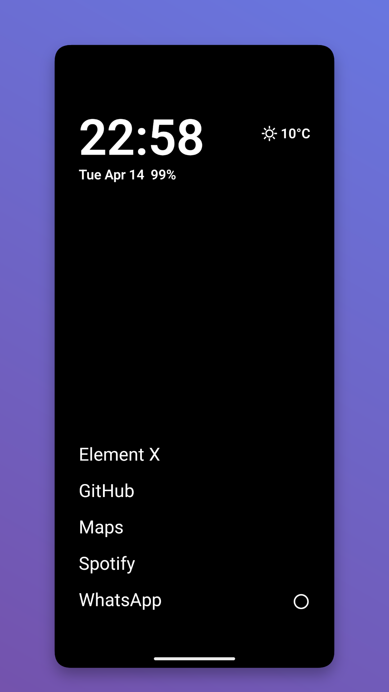
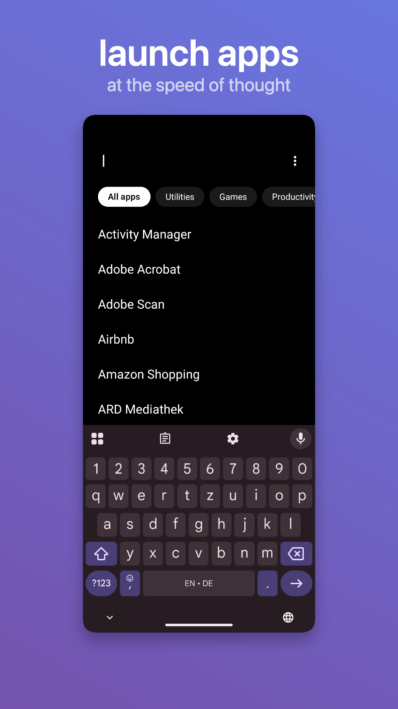
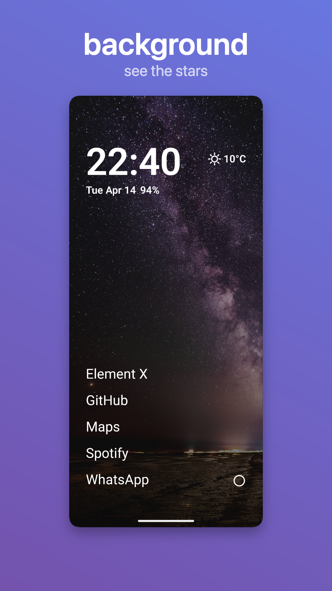
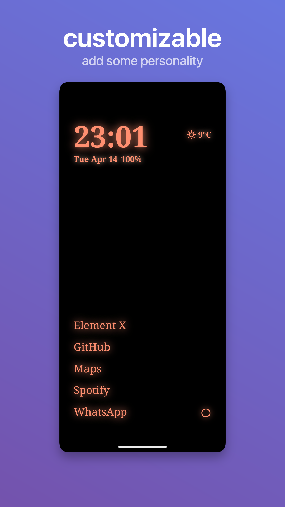
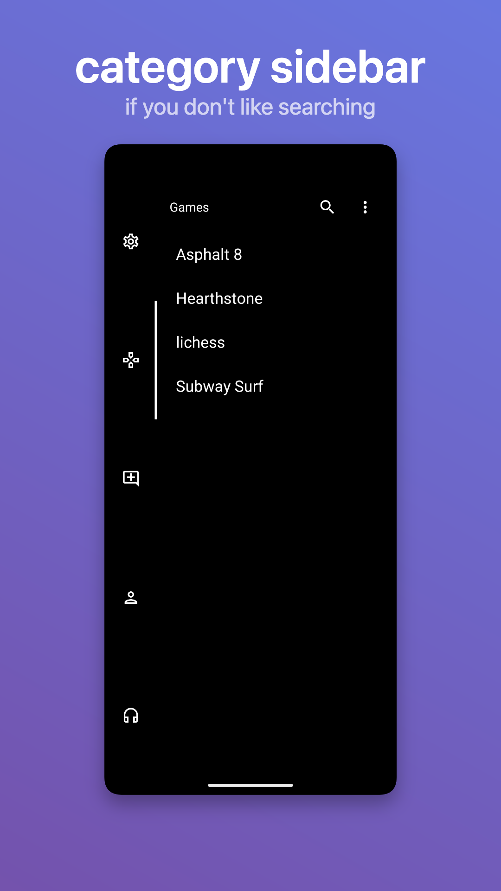
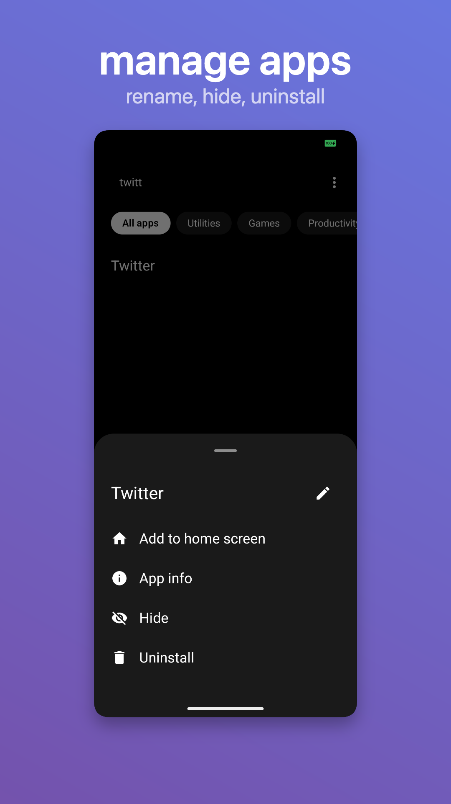

# fokus

[](https://www.gnu.org/licenses/gpl-3.0)
[](https://github.com/ni30x)
[](https://github.com/luantak/FokusLauncher)
<a href="https://hosted.weblate.org/engage/fokus-launcher/">

</a>

**fokus** is a minimal, distraction-free Android launcher designed for clarity, focus, and speed. It streamlines your mobile experience with quick access to time, weather, and core apps while eliminating visual clutter.

> ℹ️ **Fork Notice**: This repository is forked from the original [luantak/FokusLauncher](https://github.com/luantak/FokusLauncher) and actively maintained and enhanced by [ni30x](https://github.com/ni30x) with additional customizations, layout controls, and persistence enhancements.

---

## Screenshots

<p align="center">
  <a href="fastlane/metadata/android/en-US/images/phoneScreenshots/screenshot-1.png">
    
  </a>
  <a href="fastlane/metadata/android/en-US/images/phoneScreenshots/screenshot-2.png">
    
  </a>
</p>

<p align="center">
  <a href="fastlane/metadata/android/en-US/images/phoneScreenshots/screenshot-3.png">
    
  </a>
  <a href="fastlane/metadata/android/en-US/images/phoneScreenshots/screenshot-4.png">
    
  </a>
</p>

<p align="center">
  <a href="fastlane/metadata/android/en-US/images/phoneScreenshots/screenshot-5.png">
    
  </a>
  <a href="fastlane/metadata/android/en-US/images/phoneScreenshots/screenshot-6.png">
    
  </a>
</p>

---

## Key Features

### 🏠 Minimal Home Screen & Quick Access
- **Essential Info at a Glance**: Large typography clock, customizable date format, battery status, and weather with direct tap-to-open actions for your preferred calendar, clock, and weather apps.
- **Quick Access Favorites**: Pin your primary apps directly onto the home screen with customizable text labels and order.
- **Persistent App Layouts**: Home favorites, custom categories, and drawer order remember your package preferences even across uninstall and re-install cycles.
- **Right-Side Shortcut Rail**: Quick launcher rail for fast one-tap shortcuts to your essential apps and deep launcher shortcuts.

### 📱 Intelligent App Drawer & Search
- **Custom Categories**: Group apps into tailored categories or hide unwanted apps completely.
- **Category Sidebar**: Toggle a vertical category rail on the left or right side with customizable category icons.
- **Auto Keyboard & Instant Launch**: Automatically open the search keyboard on drawer open and launch the single matching app on enter.
- **Dot Search**: Direct search integration:
  - `. query` for default web or app searches.
  - `.<letter> query` for custom shortcut targets and URL search templates (e.g. `.w weather`, `.y video`).
- **Context Actions**: Long-press any app to rename, pin to home, categorize, hide, or uninstall.

### 🎨 Deep Visual Customization
- **Theme & Styles**: Choose from Classic, Neon, and Monochrome styles with subtle glow effects on typography and icons.
- **Typography & Font Choices**: Select your preferred system or custom fonts.
- **Wallpaper Options**: Support for live wallpapers, custom gallery images, or pure AMOLED pitch-black backgrounds.

### 🔒 Privacy & Android 15+ Support
- **Private Space Integration**: Secure lock/unlock integration for Android 15+ (API 35+) Private Space with dedicated app drawer sections.
- **Multi-Profile Support**: Seamless support for Work profiles alongside personal apps.

### ⚡ Smart Device Controls (Optional Accessibility)
- **Double Tap to Lock**: Instantly lock your device by double-tapping an empty area on the home screen.
- **Return Home After Lock**: Automatically return to the minimal home screen when unlocking the device after a configurable period of inactivity.

### 🚀 Seamless First-Run Onboarding
- Easy step-by-step setup for permissions, default launcher selection, gesture tips, and initial home apps configuration.

---

## Build From Source

**fokus** targets Android 8.0+ (API 26) through Android 16 (API 36).

### Development Environment

- JDK 21 installed and available via `JAVA_HOME`
- Android SDK with platform-tools, `platforms;android-36`, and `build-tools;36.0.0`
- Gradle wrapper (included)

### Build Commands

```bash
# Build the debug APK
./gradlew assembleDebug

# Install on a connected device
./gradlew installDebug

# Run all unit tests
./gradlew testDebugUnitTest
```

The compiled APK will be located at `app/build/outputs/apk/debug/app-debug.apk`.

---

## Tech Stack & Architecture

- **Language**: Kotlin
- **UI Framework**: Jetpack Compose with Material Design 3 (M3)
- **Architecture**: MVVM / Clean Architecture with unidirectional data flow
- **Dependency Injection**: Hilt
- **Local Persistence**: Room Database & DataStore Preferences
- **Weather Provider**: Open-Meteo API (no API key required, with local caching)
- **Testing**: JUnit, MockK, Robolectric

---

## Permissions

| Permission | Purpose |
| :--- | :--- |
| `REQUEST_DELETE_PACKAGES` | Trigger uninstall flow from launcher actions |
| `INTERNET` | Fetch weather forecasts from Open-Meteo |
| `ACCESS_COARSE_LOCATION` | Show location-based weather (optional runtime prompt) |
| `ACCESS_HIDDEN_PROFILES` | Support Private Space apps on Android 15+ |
| `EXPAND_STATUS_BAR` | Pull down notification shade via gestures |
| `SET_WALLPAPER` | Apply custom or solid wallpapers from settings |

---

## Contributors & Acknowledgements

- **[ni30x](https://github.com/ni30x)** — Main developer, feature additions, persistence improvements, and maintainer of this fork.
- **[luantak](https://github.com/luantak/FokusLauncher)** — Original creator of FokusLauncher.
- **Community Translators** — UI translations powered by [Weblate](https://hosted.weblate.org/engage/fokus-launcher/).

---

## License

This project is licensed under the [GNU General Public License v3.0](LICENSE).
